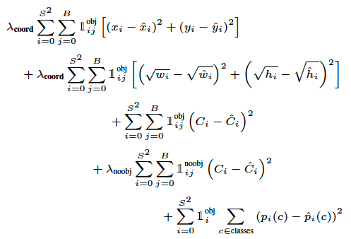
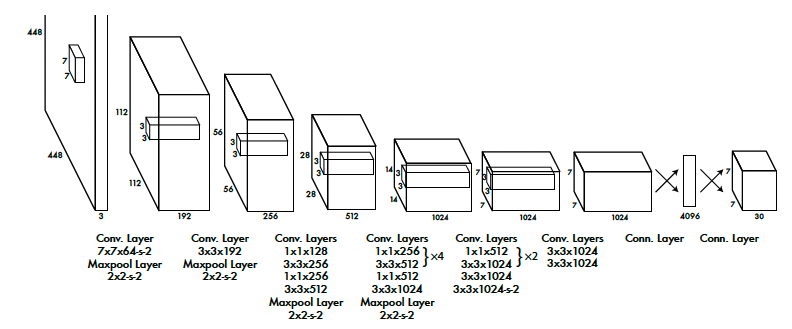
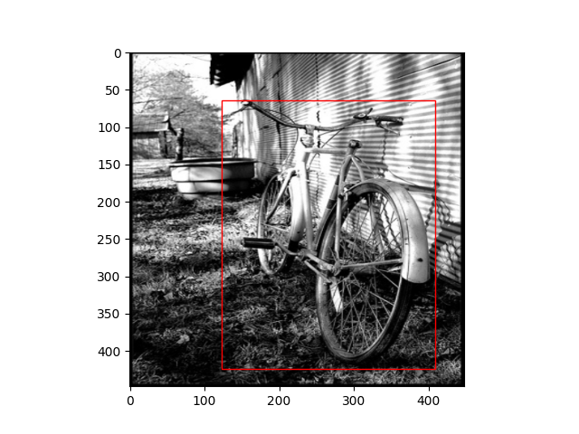

# Yolov1_from_scratch

This project is an implementation of the YOLO (You Only Look Once) object detection algorithm using PyTorch. The purpose of this project is to provide a basic understanding of how YOLO works and how to implement it from scratch. 

Important notes:
  - this has been done by following the excellent tutorials from Aladdin Persson [2], the original paper [1] and tanjeffreyz's repository[3].
  - the generated models are not maid to be used as they clearly overfit the training data.

# Dependencies
    matplotlib==3.7.1
    numpy==1.24.2
    pandas==1.5.3
    Pillow==9.4.0
    torch==1.13.1
    torchvision==0.14.1
    tqdm==4.65.0

# Files
    config.py: A configuration file containing hyperparameters for the model.
    model.py: A Python module containing the YOLO implementation.
    train.py: A Python script for training the YOLO model.
    loss.py: A Python script for calculating the loss
    dataset.py: A Python script for accessing the datas
    
# Dataset
The dataset used is the PascalVoc YOLO and is available on [Kaggle here](https://www.kaggle.com/datasets/aladdinpersson/pascalvoc-yolo)
The different models have been trained on the "8examples.csv" and "100examples.csv" for personal learning purposess.

# Usage

## Training the model
To train the YOLO model, run the following command:

python train.py --dir /path/to/data 

    dir: The path to the directory containing the training images and annotations.
    
## Training the model on Colabs
Follow the instructions in the ‘train_on_colabs.ipynb' notebook.

# Loss function 

# Architecture

# Results

# References

    [1] - 
    [2] - 
    [3] - ![tanjeffreyz's repository]https://github.com/tanjeffreyz/yolo-v1

